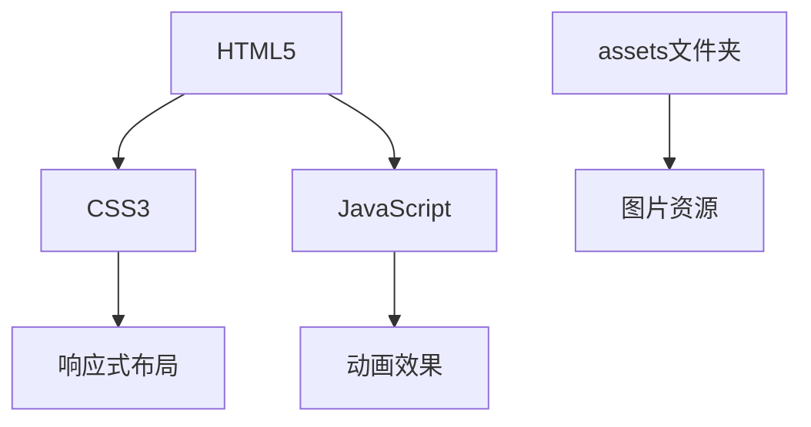

## 1. Architecture Design
个人主页采用纯前端技术栈，使用 HTML5 + CSS3 + JavaScript，无后端依赖，直接部署。



## 2. Technology Description
- 前端：HTML5 + CSS3 + JavaScript (原生实现
- 构建工具：无，直接使用原生代码
- 部署：静态文件部署

## 3. File Structure
```
/workspace/
├── index.html              # 主页面
├── styles/
│   └── style.css          # 样式文件
├── scripts/
│   └── main.js          # JavaScript 文件
└── assets/                # UI 资源文件夹
    ├── images/
    │   ├── hero-bg.jpg
    │   ├── avatar.jpg
    │   └── portfolio/
    └── icons/
```

## 4. Route Definitions
| Route | Purpose |
|-------|---------|
| / | 个人主页主页面 |

## 5. 响应式设计断点
| 断点 | 屏幕宽度 | 布局调整 |
|------|----------|----------|
| 移动端 | < 768px | 单列布局，垂直堆叠 |
| 平板 | 768px - 1024px | 调整列数和字体 |
| 桌面端 | > 1024px | 完整多列布局 |
